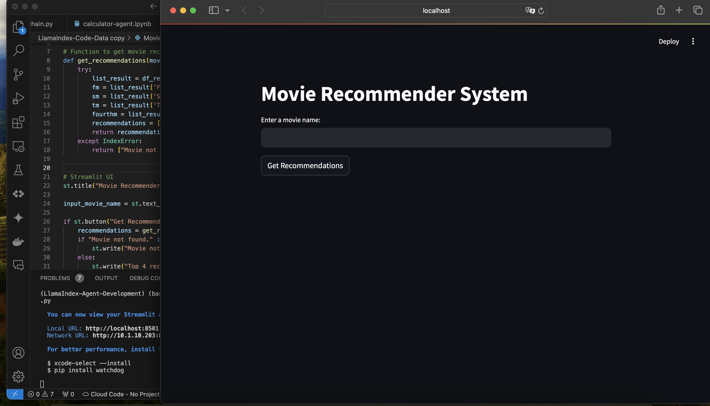

# **Movie-Recommender-System**

This Machine Learning project focuses on a **Movie Recommender System**, that takes in a *movie name* and outputs 4 movie recommendations based on that.

This project leverages Python libraries:

- Pandas for loading data and exploratory data analysis
- Seaborn and Matplot for visualizations
- Streamlit for UI

The data set used is **MovieLens Dataset** "/dataset.csv"

## Correlation Between Movies based on **User Ratings** :

This Movie Recommender System uses user ratings to generate movie recommendations based on the correlation between movies. The process involves several steps:

### Data Preparation:

- Loading the dataset containing user ratings for different movies.
- Merging this dataset with another dataset **"/movieIdTitles.csv"** containing movie titles.

### Exploratory Data Analysis:

Calculate the mean rating for each movie.
Calculate the number of ratings for each movie.
Visualize the distribution of the number of ratings and average ratings.

### Recommendation System:

- Creating a matrix with 'user_id' as rows, 'title' as columns, and 'rating' as values, where each cell represents the rating given by a particular user to a particular movie.
- Based on user ratings, calculate the correlation between the target movie and all other movies.
- Filtering movies to only include those with more than 100 ratings to ensure reliable recommendations.
- Sorting the movies by correlation in descending order to find the top matches.

### Generating Recommendations:

- Iterating each movie in the ratings data frame.
- Getting user ratings and compute correlations with all other movies for each movie.
- Creating a dataframe to store correlation results and remove NaN values.
- Joining the number of ratings for each movie to the correlation dataframe.
- Filtering and sort the movies based on correlation and the number of ratings.
- For movies with at least 5 highly correlated movies, update the dataframe with the top 4 recommendations.
- Saving the final recommendations to a CSV file for reusability.

### Demo:

1. Enter the movie name from the movies list.

2. Top 4 movie recommendations:

